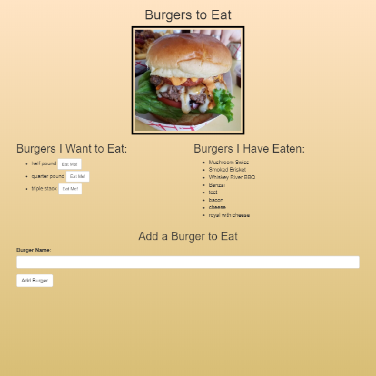

# Burger App

  ## Description:
  This MVC program allows users to maintain a list of burgers that they want to eat while also tracking the burgers that they have eaten.

  ## Links:
  * [Repo](https://github.com/locutusOO1/burger)
  * [Deployed Heroku Site](https://mysterious-stream-09586.herokuapp.com/)

  ## Table of Contents:
  * [Installation](#installation)
  * [Usage](#usage)
  * [Technology Used](#technology-used)
  * [Questions](#questions)
  * [Screenshots](#screenshots)

  ## Installation:
  * Install dependencies by running "npm install" from the terminal.
  * Run "schema.sql" (located in the Assets folder) in a server instance of MySQL to create the table structure.
  * "seeds.sql" (located in the Assets folder) has been included to provide seed data if needed. This will also need to be run in a server instance of MySQL.
  
  ## Usage:
  * Run application from the terminal with "npm start" then follow the link shown in the console.

  ## Technology Used:
  * Node.js - for JS runtime environment
  * JS/ES6+ - for program logic
  * MySQL - for DB functionality
  * ORM - for DB templating
  * handlebars - for HTML templating
  * console.table - for table output
  * Express - for serving
  * Heroku - for site and DB hosting

  ## Questions:
  * Feel free to checkout my [GitHub Profile](https://github.com/locutusOO1).

  ## Screenshots:
  ### Burger App:

  
